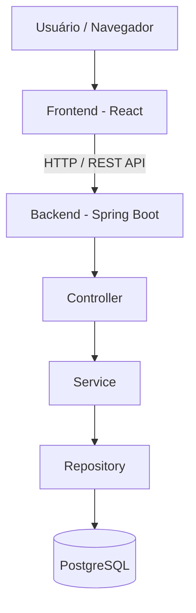
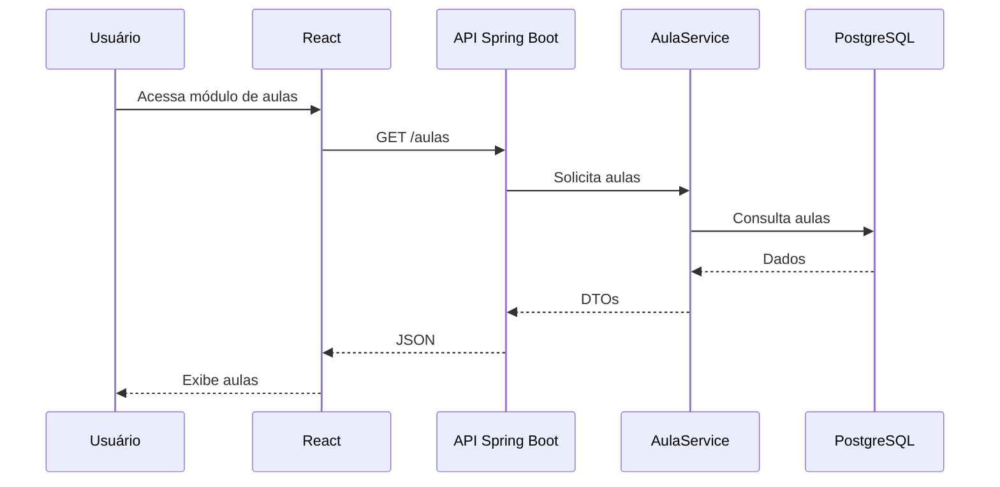

# RoboNet

## Sistema de Gerenciamento de Torneios de Robótica Educacional

O **RoboNet** é uma plataforma web desenvolvida para auxiliar no gerenciamento de atividades relacionadas à robótica educacional, centralizando informações e processos envolvidos na organização de equipes, aulas, torneios, partidas e resultados.

O projeto foi desenvolvido com uma arquitetura **full stack**, utilizando React no frontend, Java com Spring Boot no backend e PostgreSQL para persistência dos dados.

---

## 📌 Sobre o projeto

O RoboNet tem como objetivo oferecer uma solução integrada para apoiar a organização de atividades de robótica educacional.

Entre as funcionalidades previstas para a plataforma estão:

* Gerenciamento de usuários;
* Controle de acesso e permissões;
* Cadastro e gerenciamento de equipes;
* Cadastro e gerenciamento de aulas;
* Gerenciamento de torneios;
* Gerenciamento de partidas;
* Registro e consulta de resultados;
* Auditoria das ações realizadas no sistema;
* Mecanismos de proteção e privacidade dos dados.

A plataforma foi projetada considerando a necessidade de organização das informações e a aplicação de boas práticas de segurança e proteção de dados.

---

## 🏗️ Arquitetura

A aplicação utiliza uma arquitetura dividida em camadas, separando as responsabilidades do frontend, backend e banco de dados.



### Frontend

O frontend é responsável pela interface de interação com o usuário.

Tecnologias utilizadas:

* React 18;
* Vite;
* React Router DOM;
* JavaScript;
* HTML;
* CSS.

### Backend

O backend disponibiliza a API REST responsável pelo processamento das requisições e aplicação das regras de negócio.

Tecnologias utilizadas:

* Java 17;
* Spring Boot 3.3.5;
* Spring Web;
* Spring Data JPA;
* Hibernate;
* Jakarta Bean Validation;
* Maven.

### Banco de dados

O sistema utiliza:

* PostgreSQL 16.

O banco é responsável pelo armazenamento das informações utilizadas pela aplicação, incluindo dados relacionados às aulas e seus respectivos temas.

### Infraestrutura

Para facilitar a execução do sistema, foram utilizados:

* Docker;
* Docker Compose;
* Nginx.

---

# 📚 Branches do projeto

O desenvolvimento do RoboNet é organizado em diferentes branches, de acordo com os módulos implementados.

## `entrega1409`

Branch utilizada como base para a entrega das funcionalidades do dia 14/09/2026 do projeto.

## `admin_usuarios`

Branch destinada ao módulo de **administração de usuários**, contemplando funcionalidades relacionadas ao gerenciamento dos usuários e seus respectivos acessos.

## `cadastro_aulas`

Branch destinada ao módulo de **cadastro e gerenciamento de aulas de robótica educacional**.

O módulo permite:

* Listar aulas cadastradas;
* Pesquisar aulas;
* Visualizar detalhes de uma aula;
* Cadastrar novas aulas;
* Editar aulas existentes;
* Excluir aulas;
* Associar aulas a temas de robótica;
* Validar informações antes do cadastro;
* Exibir mensagens de sucesso e erro;
* Confirmar operações de exclusão.

---

# 📖 Módulo de Cadastro de Aulas

O módulo de cadastro de aulas foi desenvolvido utilizando React no frontend e Spring Boot no backend.

A estrutura do módulo segue uma separação de responsabilidades entre interface, serviços, regras de negócio e persistência.

## Fluxo da aplicação



---

# 🔌 API de Aulas

O backend disponibiliza os seguintes endpoints:

| Método   | Endpoint       | Descrição                  |
| -------- | -------------- | -------------------------- |
| `GET`    | `/aulas`       | Lista todas as aulas       |
| `GET`    | `/aulas/{id}`  | Consulta uma aula pelo ID  |
| `GET`    | `/aulas/temas` | Lista os temas disponíveis |
| `POST`   | `/aulas`       | Cadastra uma nova aula     |
| `PUT`    | `/aulas/{id}`  | Atualiza uma aula          |
| `DELETE` | `/aulas/{id}`  | Exclui uma aula            |

As requisições são processadas pelo backend e os dados são persistidos no PostgreSQL.

---

# 🗂️ Estrutura do projeto

```text
robonet/
│
├── backend/
│   ├── Dockerfile
│   ├── pom.xml
│   └── src/
│       └── main/
│           ├── java/
│           │   └── br/com/aulas/
│           │       ├── AulasBackendApplication.java
│           │       │
│           │       ├── config/
│           │       │   └── WebConfig.java
│           │       │
│           │       ├── controller/
│           │       │   └── AulaController.java
│           │       │
│           │       ├── dto/
│           │       │   ├── AulaRequest.java
│           │       │   └── AulaResponse.java
│           │       │
│           │       ├── exception/
│           │       │   ├── AulaNotFoundException.java
│           │       │   └── GlobalExceptionHandler.java
│           │       │
│           │       ├── model/
│           │       │   ├── Aula.java
│           │       │   └── AulaTema.java
│           │       │
│           │       ├── repository/
│           │       │   ├── AulaRepository.java
│           │       │   └── AulaTemaRepository.java
│           │       │
│           │       └── service/
│           │           └── AulaService.java
│           │
│           └── resources/
│               └── application.properties
│
├── frontend/
│   ├── Dockerfile
│   ├── nginx.conf
│   ├── package.json
│   ├── vite.config.js
│   └── src/
│       ├── app.jsx
│       ├── main.jsx
│       │
│       ├── componentes/
│       │   ├── aulaModalAlert.jsx
│       │   ├── aulaModalCarregando.jsx
│       │   ├── aulaModalConfirmar.jsx
│       │   ├── aulaModalIncluir.jsx
│       │   └── aulaModalVisualizar.jsx
│       │
│       ├── pagina/
│       │   └── aulas.jsx
│       │
│       ├── servicos/
│       │   └── api.js
│       │
│       └── style/
│           └── global.css
│
├── docker-compose.yml
├── package.json
├── package-lock.json
└── README.md
```

---

# ⚙️ Como executar o projeto

## Pré-requisitos

Antes de iniciar, é necessário possuir:

* Git;
* Docker;
* Docker Compose;
* Node.js, caso seja utilizada a execução sem Docker;
* Java 17 e Maven, caso o backend seja executado manualmente;
* PostgreSQL.

---

## 🐳 Execução utilizando Docker

Na raiz do projeto, execute:

```bash
docker compose up --build
```

Após a inicialização:

### Frontend

```text
http://localhost:8080
```

### Backend

```text
http://localhost:4000
```

### PostgreSQL

```text
localhost:5432
```

O banco utilizado pela aplicação é:

```text
robonet
```

---

# 🔄 Atualização do frontend

Após alterações nos arquivos do frontend, pode ser necessário reconstruir o container:

```bash
docker compose build frontend
docker compose up -d frontend
```

Para reconstruir sem utilizar o cache:

```bash
docker compose build --no-cache frontend
docker compose up -d frontend
```

Depois, atualize o navegador utilizando:

```text
Ctrl + F5
```

---

# 🔧 Atualização completa

Quando houver alterações no backend, banco de dados ou infraestrutura:

```bash
docker compose up --build -d
```

Para verificar os containers:

```bash
docker compose ps
```

Para acompanhar os logs:

```bash
docker compose logs -f
```

---

# 💻 Execução sem Docker

## Backend

Entre na pasta:

```bash
cd backend
```

Execute:

```bash
mvn spring-boot:run
```

O backend ficará disponível em:

```text
http://localhost:4000
```

## Frontend

Entre na pasta:

```bash
cd frontend
```

Instale as dependências:

```bash
npm install
```

Execute:

```bash
npm run dev
```

O Vite disponibilizará a aplicação em:

```text
http://localhost:5173
```

---

# 🗄️ Banco de dados

O módulo de aulas utiliza duas estruturas principais:

### `aulastemas`

Armazena os temas utilizados para categorizar as aulas.

Exemplos:

* Introdução à Robótica;
* Sensores;
* Programação;
* Projeto final.

### `aulas`

Armazena os dados das aulas cadastradas e possui relacionamento com a tabela de temas.

A relação pode ser representada como:

```text
AulaTema
   │
   └── 1:N
          │
          └── Aula
```

---

# 🧩 Organização do Backend

O backend segue uma organização baseada em responsabilidades.

### Controller

Responsável por receber as requisições HTTP e disponibilizar os endpoints da API.

```text
AulaController
```

### Service

Concentra as regras de negócio:

```text
AulaService
```

### Repository

Responsável pela comunicação com o banco utilizando Spring Data JPA:

```text
AulaRepository
AulaTemaRepository
```

### DTO

Objetos utilizados para entrada e saída de dados:

```text
AulaRequest
AulaResponse
```

### Exception

Responsável pelo tratamento de situações excepcionais:

```text
AulaNotFoundException
GlobalExceptionHandler
```

---

# 🎨 Organização do Frontend

O frontend utiliza componentes React para separar as responsabilidades da interface.

### Página de aulas

```text
pagina/aulas.jsx
```

Responsável pela listagem, pesquisa e ações relacionadas às aulas.

### Cadastro e edição

```text
componentes/aulaModalIncluir.jsx
```

Utilizado para cadastrar e editar aulas.

### Visualização

```text
componentes/aulaModalVisualizar.jsx
```

Apresenta os detalhes da aula em modo de consulta.

### Confirmação

```text
componentes/aulaModalConfirmar.jsx
```

Solicita confirmação antes da exclusão de uma aula.

### Alertas

```text
componentes/aulaModalAlert.jsx
```

Apresenta mensagens de sucesso ou erro.

### Carregamento

```text
componentes/aulaModalCarregando.jsx
```

Apresenta um indicador visual enquanto as requisições estão sendo processadas.

### Comunicação com API

```text
servicos/api.js
```

Centraliza as chamadas realizadas pelo frontend para o backend.

---

# 🔐 Segurança e organização

O RoboNet considera aspectos de segurança e controle de acesso como parte da arquitetura da aplicação.

A proposta geral do sistema inclui:

* Autenticação;
* Autorização por perfil;
* Controle de permissões;
* Validação de dados;
* Auditoria;
* Proteção de dados pessoais;
* Separação entre frontend, backend e persistência.

Esses aspectos estão relacionados aos requisitos definidos para a plataforma de gerenciamento de torneios de robótica educacional. A arquitetura prevista utiliza React no frontend, uma API REST com Spring Boot no backend e PostgreSQL como camada de persistência.

---

# 🚀 Próximas funcionalidades

A evolução do RoboNet poderá incluir:

* Cadastro de equipes;
* Cadastro de torneios;
* Registro de resultados;
* Dashboard de acompanhamento;
* Auditoria das operações;
* Relatórios;
* Integração com Google Calendar;
* Envio de notificações por e-mail;
* Melhorias relacionadas à privacidade e proteção de dados.

Essas funcionalidades estão alinhadas ao objetivo geral do projeto de centralizar usuários, equipes, torneios, partidas e resultados em uma única plataforma.

---

# 🌱 Git e branches

O desenvolvimento é organizado utilizando branches para separar as funcionalidades.

```text
main
 │
 └── entrega1409
       │
       ├── admin_usuarios
       │
       └── cadastro_aulas
```

### Branch `admin_usuarios`

Desenvolvimento das funcionalidades relacionadas ao gerenciamento de usuários e administração do sistema.

### Branch `cadastro_aulas`

Desenvolvimento das funcionalidades relacionadas ao cadastro e gerenciamento de aulas de robótica.

Essa organização permite desenvolver cada módulo de maneira independente e posteriormente integrá-los à versão principal do sistema.

---

# 👩‍💻 Projeto acadêmico

O RoboNet faz parte de um projeto acadêmico voltado ao desenvolvimento de uma plataforma web para gerenciamento de torneios de robótica educacional.

O desenvolvimento envolve conhecimentos de:

* Engenharia de software;
* Desenvolvimento web;
* Programação orientada a objetos;
* Banco de dados;
* APIs REST;
* Arquitetura de software;
* Segurança da informação;
* Controle de acesso;
* Proteção de dados;
* Desenvolvimento de interfaces.

---

# 📄 Licença

Projeto desenvolvido para fins acadêmicos.
